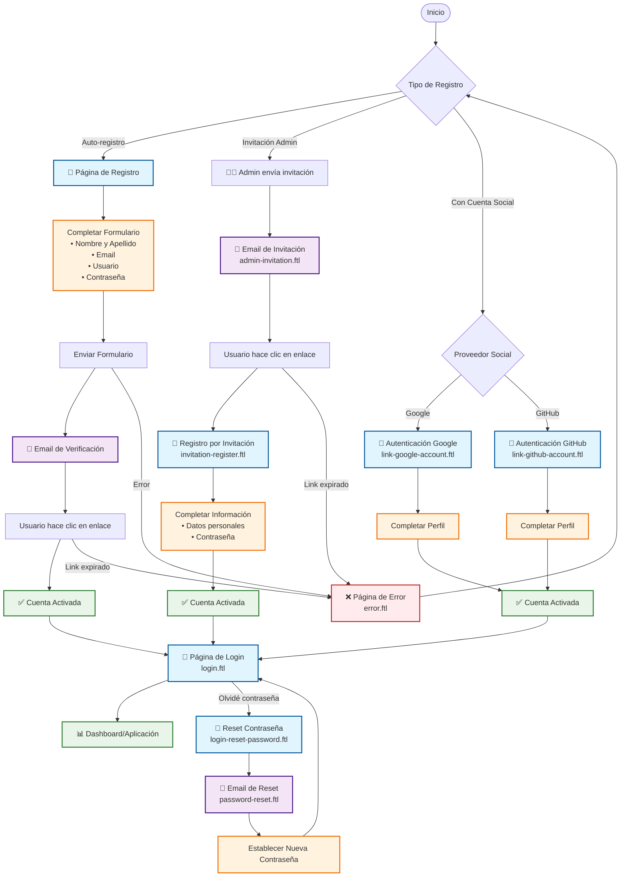

# ZMart Keycloak Theme

Este es el tema personalizado de ZMart para Keycloak, diseñado con un enfoque moderno que incluye modo claro/oscuro, efectos de glassmorphism y diseño responsivo.

## 📁 Estructura del Tema

```
themes/zmart/
├── README.md                    # Este archivo
├── account/                     # Módulo de gestión de cuenta
│   ├── README.md               # Documentación del módulo account
│   ├── theme.properties        # Configuración del tema account
│   └── resources/
│       └── css/
│           └── account.css     # Estilos para páginas de cuenta
├── admin/                      # Módulo de administración
│   ├── README.md               # Documentación del módulo admin
│   ├── theme.properties        # Configuración del tema admin
│   └── resources/
│       └── css/
│           └── admin.css       # Estilos para consola de administración
├── email/                      # Módulo de plantillas de email
│   ├── README.md               # Documentación del módulo email
│   ├── theme.properties        # Configuración del tema email
│   ├── html/                   # Plantillas HTML de emails
│   │   ├── admin-invitation.ftl
│   │   ├── admin-user-invitation.ftl
│   │   ├── email-verification.ftl
│   │   └── password-reset.ftl
│   └── resources/
│       └── css/
│           └── email.css       # Estilos para emails
└── login/                      # Módulo de autenticación
    ├── README.md               # Documentación del módulo login
    ├── theme.properties        # Configuración del tema login
    ├── demo-login.html         # Demo de referencia del diseño
    ├── error.ftl               # Página de errores
    ├── invitation-register.ftl # Registro por invitación
    ├── link-github-account.ftl # Enlace cuenta GitHub
    ├── link-google-account.ftl # Enlace cuenta Google
    ├── login-reset-password.ftl # Reset de contraseña
    ├── login.ftl               # Página de login principal
    ├── register.ftl            # Página de registro
    ├── template.ftl            # Plantilla base
    └── resources/
        ├── css/
        │   └── styles.css      # Estilos principales del login
        └── img/
            └── background.png  # Imagen de fondo
```

## 🎨 Sistema de Diseño

### Colores Principales
- **Brick Orange**: `#c2410c` (primary)
- **Blue**: `#2563eb` (secondary)
- **Gradientes**: Combinaciones de brick y blue para efectos visuales

### Características del Diseño
- **Glassmorphism**: Efectos de vidrio con `backdrop-filter: blur(12px)`
- **Modo Claro/Oscuro**: Sistema automático con toggle manual
- **Tipografía**: Google Fonts Inter (400, 500, 600, 700, 800)
- **Diseño Responsivo**: Mobile-first con breakpoints adaptativos
- **Layout de Dos Columnas**: Hero section + formulario

## 🚀 Instalación y Uso

1. **Ubicación**: Este tema debe estar en `{KEYCLOAK_HOME}/themes/zmart/`
2. **Configuración**: En la consola de administración de Keycloak, selecciona "zmart" como tema
3. **Módulos**: Cada módulo (login, account, admin, email) puede configurarse independientemente

## 📦 Módulos Disponibles

### 🔐 Login Module
Maneja todas las páginas relacionadas con autenticación:
- Inicio de sesión
- Registro de usuarios
- Reset de contraseña
- Enlaces de cuentas sociales
- Manejo de errores

### 👤 Account Module
Gestión de cuenta de usuario:
- Perfil de usuario
- Configuración de seguridad
- Gestión de sesiones
- Aplicaciones vinculadas

### ⚙️ Admin Module
Consola de administración personalizada:
- Dashboard administrativo
- Gestión de usuarios
- Configuración del realm
- Monitoreo del sistema

### 📧 Email Module
Plantillas de correo electrónico:
- Verificación de email
- Reset de contraseña
- Invitaciones administrativas
- Notificaciones del sistema

## � Flujo de Creación de Usuarios

El siguiente diagrama muestra los diferentes flujos de creación de usuarios en el sistema ZMart:



### 📋 Descripción de Flujos

#### 🔐 Auto-registro (Flujo Estándar)
1. **Acceso**: Usuario visita la página de registro (`register.ftl`)
2. **Formulario**: Completa información personal y credenciales
3. **Verificación**: Recibe email de verificación (`email-verification.ftl`)
4. **Activación**: Hace clic en el enlace para activar la cuenta
5. **Acceso**: Puede iniciar sesión normalmente

#### 👨‍💼 Invitación Administrativa
1. **Invitación**: Administrador envía invitación desde la consola admin
2. **Email**: Usuario recibe email de invitación (`admin-invitation.ftl`)
3. **Registro**: Accede al formulario de registro por invitación (`invitation-register.ftl`)
4. **Completar**: Establece contraseña y completa perfil
5. **Activación**: Cuenta queda inmediatamente activa

#### 🔗 Registro con Proveedores Sociales
1. **Selección**: Usuario elige proveedor social (Google/GitHub)
2. **Autenticación**: Se redirige al proveedor para autenticación
3. **Enlace**: Sistema vincula la cuenta social (`link-*-account.ftl`)
4. **Perfil**: Usuario completa información adicional si es necesaria
5. **Activación**: Cuenta queda activa con enlace social

#### 🔑 Recuperación de Contraseña
1. **Solicitud**: Usuario solicita reset desde login (`login-reset-password.ftl`)
2. **Email**: Recibe enlace de recuperación (`password-reset.ftl`)
3. **Nueva contraseña**: Establece nueva contraseña
4. **Acceso**: Puede iniciar sesión con nuevas credenciales

### 🎨 Plantillas Involucradas

| Plantilla | Propósito | Módulo |
|-----------|-----------|---------|
| `register.ftl` | Registro estándar de usuarios | Login |
| `invitation-register.ftl` | Registro por invitación administrativa | Login |
| `link-google-account.ftl` | Enlace de cuenta Google | Login |
| `link-github-account.ftl` | Enlace de cuenta GitHub | Login |
| `login-reset-password.ftl` | Solicitud de reset de contraseña | Login |
| `error.ftl` | Manejo de errores en el proceso | Login |
| `email-verification.ftl` | Email de verificación de cuenta | Email |
| `admin-invitation.ftl` | Email de invitación administrativa | Email |
| `password-reset.ftl` | Email de reset de contraseña | Email |

## �🛠️ Personalización

### Variables CSS
El tema utiliza CSS Custom Properties para fácil personalización:

```css
:root {
  --brick-700: #c2410c;  /* Color principal */
  --brick-600: #dc2626;  /* Variante */
  --blue-600: #2563eb;   /* Color secundario */
  --bg-primary: #ffffff; /* Fondo principal */
  --text-primary: #1f2937; /* Texto principal */
}
```

### Modo Oscuro
Las variables se adaptan automáticamente:

```css
[data-theme="dark"] {
  --bg-primary: #1f2937;
  --text-primary: #f9fafb;
}
```

## 📱 Compatibilidad

- **Navegadores**: Chrome, Firefox, Safari, Edge (últimas 2 versiones)
- **Dispositivos**: Desktop, tablet, móvil
- **Accesibilidad**: WCAG 2.1 AA compliant
- **Keycloak**: Versiones 20.x y superiores

## 🔧 Desarrollo

### Estructura de Archivos
- **`.ftl`**: Plantillas FreeMarker para HTML
- **`.css`**: Hojas de estilo
- **`.properties`**: Configuración de temas
- **`.html`**: Demos y referencias

### Mejores Prácticas
1. Mantén la consistencia con el sistema de diseño base
2. Usa las variables CSS definidas para colores y spacing
3. Prueba en modo claro y oscuro
4. Verifica la responsividad en diferentes dispositivos
5. Mantén la accesibilidad (ARIA labels, contraste, etc.)

## 📝 Notas de Versión

### v1.0.0 (Actual)
- Sistema de diseño moderno con glassmorphism
- Soporte completo para modo claro/oscuro
- Plantillas simplificadas y optimizadas
- Diseño responsivo mejorado
- Documentación completa de módulos

## 🤝 Contribución

Para contribuir al tema:
1. Sigue las guías de estilo establecidas
2. Documenta cambios significativos
3. Prueba en múltiples navegadores y dispositivos
4. Mantén la compatibilidad con versiones anteriores

## 📞 Soporte

Para soporte o preguntas sobre el tema, contacta al equipo de desarrollo.